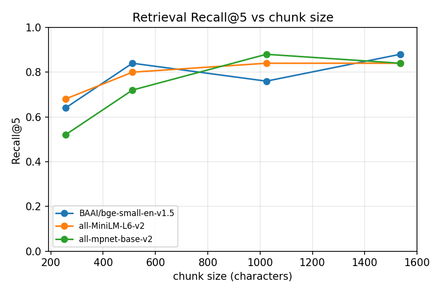
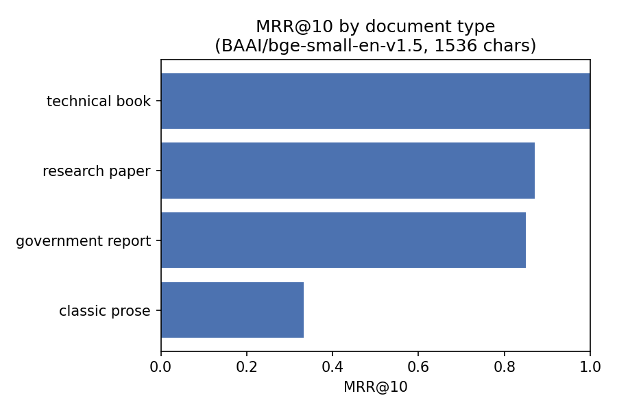
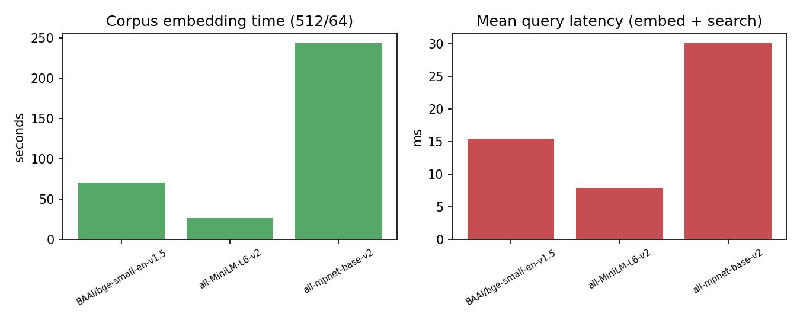

# Retrieval Evaluation

An ablation study of the retrieval stage of this RAG system: **which embedding
model and chunk size actually matter, and how does retrieval quality vary across
document types.**

Retrieval is evaluated in isolation (no LLM), so the full 12-configuration grid
runs in ~22 minutes on CPU and reruns from cache in ~20 seconds. Generation
quality is assessed separately by [`evaluation.py`](evaluation.py), which runs the
end-to-end pipeline over the **same corpus and queries** and reports answer
keyword-recall and an LLM-judge score by document type.

## TL;DR

| Finding | Evidence |
|---|---|
| **Chunk size dominates model choice.** Going from 256 → 1024–1536 characters lifts Recall@5 by 15–36 points for every model; the best three configs (different models) sit within 4 points of each other. | Table 1, Figure 1 |
| **A 384-dim model is enough.** `bge-small` (384-dim) and `MiniLM-L6` (384-dim) match or beat `mpnet-base` (768-dim) while embedding the corpus 3–9× faster. | Table 1, Figure 3 |
| **Best config: `bge-small-en-v1.5` @ 1536/192** — Recall@5 = 0.88, Recall@10 = 0.92, MRR@10 = 0.79, nDCG@10 = 0.76. | Table 1 |
| **Retrieval quality is document-type dependent and preprocessing-bound.** Technical book / report / research paper reach Recall@5 = 1.00; a heavily foot-noted classic-prose edition stays at 0.40 regardless of model. | Table 2, Figure 2 |

## Corpus

Five public-domain documents, four types, chosen for contrasting structure and
vocabulary. Built by [`eval/build_corpus.py`](eval/build_corpus.py).

| Document | Type | Pages | Notes |
|---|---|---|---|
| `transformer.pdf` — *Attention Is All You Need* | research paper | 15 | arXiv 1706.03762 |
| `rag_paper.pdf` — *Retrieval-Augmented Generation…* | research paper | 19 | arXiv 2005.11401 |
| `nist_ai_rmf.pdf` — *AI Risk Management Framework 1.0* | government report | 48 | NIST AI 100-1 |
| `art_of_war.pdf` — *The Art of War* (Giles tr.) | classic prose | 40 | Gutenberg #132, rendered to PDF |
| `EffectiveProjectManagement_Wysocki.pdf` | technical book | 250\* | \*first 250 of 796 pages, to keep it size-comparable |

All five documents are embedded into **one shared FAISS index** per configuration,
so every query is retrieved against the full multi-document corpus (distractor
documents included) — the realistic setting.

## Method

- **Queries:** 25 questions, 5 per document, in [`eval/queries.json`](eval/queries.json).
- **Ground truth:** keyword-based. Each query carries a list of expected keywords
  (specific terms from its gold passage). A retrieved chunk is counted **relevant**
  if it contains **≥ 2 distinct expected keywords** (case-insensitive substring).
  This is an approximate proxy for a manually-labelled gold passage — cheap to
  build and hard to game (a chunk matching two specific terms is almost always
  on-topic), but it under-counts correct chunks that paraphrase. Results should be
  read as *relative* comparisons between configs, not absolute retrieval accuracy.
- **Grid:** 3 embedding models × 4 chunk sizes.
  - Models: `all-MiniLM-L6-v2` (384-dim), `all-mpnet-base-v2` (768-dim),
    `BAAI/bge-small-en-v1.5` (384-dim, query prefixed with its recommended
    instruction).
  - Chunk sizes (chars / overlap): 256/32, 512/64, 1024/128, 1536/192.
- **Embeddings:** L2-normalized; FAISS `IndexFlatIP` (exact cosine similarity).
- **Metrics** (mean over 25 queries, top-10 retrieved):
  - **Recall@k** — fraction of queries with ≥ 1 relevant chunk in the top *k*
    (k = 1, 3, 5, 10). *(= hit@k; with one gold passage per query this is the
    natural recall measure.)*
  - **MRR@10** — mean reciprocal rank of the first relevant chunk.
  - **nDCG@10** — binary-gain nDCG, IDCG normalized over relevant chunks found in
    the top 10.
  - **Latency** — mean wall-clock per query (query embedding + FAISS search),
    single thread.

Reproduce with:

```bash
python eval/build_corpus.py     # once
python benchmark.py             # full grid  -> eval/results*.{csv,md}, eval/figures/
python benchmark.py --quick     # 2x2 smoke test
python evaluation.py --quick    # end-to-end (needs Ollama), same corpus + queries
```

## Results

### Table 1 — Overall (mean over 25 queries)

| model | chunk | Recall@1 | Recall@3 | Recall@5 | Recall@10 | MRR@10 | nDCG@10 | latency |
|---|---|---|---|---|---|---|---|---|
| bge-small-en-v1.5 | 256/32 | 0.40 | 0.60 | 0.64 | 0.72 | 0.52 | 0.55 | 15 ms |
| bge-small-en-v1.5 | 512/64 | 0.60 | 0.80 | 0.84 | 0.88 | 0.70 | 0.71 | 15 ms |
| bge-small-en-v1.5 | 1024/128 | 0.60 | 0.76 | 0.76 | 0.84 | 0.69 | 0.70 | 16 ms |
| **bge-small-en-v1.5** | **1536/192** | **0.72** | **0.80** | **0.88** | **0.92** | **0.79** | **0.76** | 17 ms |
| MiniLM-L6-v2 | 256/32 | 0.28 | 0.60 | 0.68 | 0.76 | 0.45 | 0.49 | 8 ms |
| MiniLM-L6-v2 | 512/64 | 0.52 | 0.76 | 0.80 | 0.84 | 0.65 | 0.67 | 8 ms |
| MiniLM-L6-v2 | 1024/128 | 0.64 | 0.84 | 0.84 | 0.84 | 0.73 | 0.71 | 8 ms |
| MiniLM-L6-v2 | 1536/192 | 0.60 | 0.84 | 0.84 | 0.84 | 0.70 | 0.70 | 9 ms |
| mpnet-base-v2 | 256/32 | 0.24 | 0.48 | 0.52 | 0.76 | 0.39 | 0.48 | 30 ms |
| mpnet-base-v2 | 512/64 | 0.40 | 0.72 | 0.72 | 0.84 | 0.55 | 0.60 | 30 ms |
| mpnet-base-v2 | 1024/128 | 0.60 | 0.80 | 0.88 | 0.88 | 0.71 | 0.72 | 29 ms |
| mpnet-base-v2 | 1536/192 | 0.48 | 0.84 | 0.84 | 0.92 | 0.65 | 0.69 | 29 ms |



*Figure 1 — Recall@5 rises steeply from 256 to ~512–1024 characters, then
plateaus. The three models converge once chunks are large enough; at 256 chars
they differ by up to 16 points.*

### Table 2 — Recall@5 by document type

| model | chunk | classic prose | government report | research paper | technical book |
|---|---|---|---|---|---|
| bge-small | 256/32 | 0.40 | 0.40 | 0.80 | 0.80 |
| bge-small | 512/64 | 0.40 | 0.80 | 1.00 | 1.00 |
| bge-small | 1024/128 | 0.40 | 0.80 | 0.90 | 0.80 |
| **bge-small** | **1536/192** | **0.40** | **1.00** | **1.00** | **1.00** |
| MiniLM-L6 | 1024/128 | 0.40 | 0.80 | 1.00 | 1.00 |
| MiniLM-L6 | 1536/192 | 0.40 | 0.80 | 1.00 | 1.00 |
| mpnet-base | 1024/128 | 0.60 | 0.80 | 1.00 | 1.00 |
| mpnet-base | 1536/192 | 0.40 | 0.80 | 1.00 | 1.00 |



*Figure 2 — Best config, per document type. Structured documents (book, report,
paper) are essentially solved; the classic-prose edition is the bottleneck.*

### Figure 3 — Cost



*Corpus embedding (≈1,900 chunks, CPU): MiniLM 27 s, bge-small 75 s, mpnet 250 s.
Per-query latency: MiniLM 8 ms, bge-small 15 ms, mpnet 30 ms. mpnet's 768-dim
vectors cost 3–9× more for no retrieval gain on this corpus.*

## Analysis

**1. Chunk size is the dominant hyperparameter.**
For all three models, moving off the 256-char setting is worth 15–36 points of
Recall@5 and 20–34 points of MRR@10 — larger than any model-to-model gap. Small
chunks fragment the multi-fact answers these queries target (e.g. "the five
Process Groups", "the four quadrants"): the enumeration is split across chunks, so
no single chunk clears the 2-keyword relevance bar and the top-k fills with
partial matches. 1024–1536 chars is the plateau; beyond that, recall is flat and
chunks start pulling in unrelated text. This matches an earlier end-to-end
observation on the technical book alone, where 500 → 900 chars lifted answer
keyword-recall from 40 % to 74 %.

**2. Bigger embedding model ≠ better retrieval here.**
`mpnet-base-v2` (768-dim, the usual "quality" default) never beats the two
384-dim models by more than a point at their best chunk sizes, and is markedly
worse at 256–512 chars. Given it embeds the corpus 3–9× slower and doubles the
index size, the 384-dim models are the right call for this workload.
`bge-small-en-v1.5` with its query instruction prefix is the best single config
and degrades most gracefully at large chunk sizes.

**3. Retrieval quality is preprocessing-bound, not just model-bound.**
The `classic prose` document sits at Recall@5 = 0.40 across *every* model and
chunk size. The cause is document structure, not embeddings: the Gutenberg
edition of *The Art of War* interleaves **421 bracketed translator's notes**
line-by-line with the text, and the canonical passages are split mid-enumeration
by those insertions (e.g. the five factors list breaks as
`… (4) The [It appears from what follows that Sun Tzŭ means …`). Fixed-size
character chunking cannot reassemble the fact, so ≥ 2-keyword relevance is
unreachable for 3 of 5 prose queries. A document whose target spans are
fragmented by noise defeats naive chunking regardless of the retriever — a
structure-aware splitter (or note-stripping in `ingest.py`) would be the fix.

**4. Implication for the app defaults.**
The shipped defaults (`all-MiniLM-L6-v2`, 900/150) land in the good region:
MiniLM at 1024/128 gives Recall@5 = 0.84, MRR = 0.73 at 8 ms/query. Switching the
default embedding model to `bge-small-en-v1.5` and the chunk size to ~1200–1500
would add ~4 points of Recall@5 and ~6 of MRR for +7 ms/query — a reasonable
change, gated on the classic-prose weakness being acceptable for the target use.

## Limitations

- **Keyword ground truth**, not human-labelled gold passages: under-counts
  paraphrased-but-correct chunks, so absolute numbers are conservative. Relative
  ordering of configs is the trustworthy output.
- **25 queries / 5 documents** — enough to separate configurations by 10+ points
  confidently, not enough for fine distinctions (±4 points is noise).
- **English only**; one language, four document types.
- **Exact search** (`IndexFlatIP`) — no approximate-index (IVF/HNSW) recall/speed
  trade-off is explored; irrelevant at this corpus size.
- **Retrieval only.** Better retrieval is necessary but not sufficient for better
  answers; see `evaluation.py` for the generation-side metrics.
